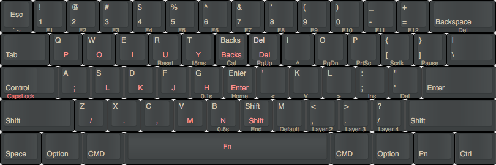

# POK3R keyboard layouts for macOS/Linux and one hand 
For those who don't know what a POK3R keyboard is, this is a decent [review](https://www.youtube.com/watch?v=8wjW-Or1jg8).
Multiple sources to buy, e.g. [amazon](http://smile.amazon.com/Mechanical-Keyboard-Keycaps-Cherry-Mx-Blue/dp/B00OFM51L2/), [mechanicalkeyboards.com](https://mechanicalkeyboards.com/shop/index.php?l=product_detail&p=1233)

## General POK3R programming info
* [POK3R User Manual](http://www.vortexgear.tw/db/upload/webdata4/vortex_20156296454697283.pdf) on Vortex's site
* Factory reset: Hold both the left and right `ALT` keys
* Reset selected layer only: `FN + R` until LED under spacebar stops flashing

### Programming of layers 2-4:
* Default layer cannot be programmed
* `FN + R_Ctrl`  (use `L_Ctrl` if `FN` has been reassigned already) -> second LED under space bar is now lit
* hit `target key`, then: `new content` (can be up to 32 char), then: `PN` (second LED will blink while programming)
* `FN + R_Ctrl` to exit programming -> second LED extinguishes
* During programming, use the keys as labelled on the keyboard, irrespective of any reassignments

## Layer 2 (BLue):
`FN + ,` to switch to Layer  2
* `FN + R_Ctrl` to enter programming
* Swap Cmd/Opt keys on both sides of space bar:
  * L_Cmd: `L_Alt` then: `L_WIN` then: `PN`
  * L_Option: `L_WIN` then: `L_Alt` then: `PN`
  * R_CMD: `R_Alt` then: `L_WIN` then: `PN`
* `FN + R_Ctrl` to exit programming

### Common key bindings 

* VIM like HJKL:
  * Left: `FN + H` then: `FN + J` then: `PN`
  * Down: `FN + J` then: `FN + K` then: `PN`
  * Up: `FN + K` then: `FN + I` then: `PN`

* By default `L_Shift +  ESC = ~`, to type `~` easier is necessary switch the `Shifts`
  * `L_Shift` then: `R_Shift` then: `PN`
  * `R_Shift` then: `L_Shift` then: `PN`

* `CapsLock` to `L_Ctrl` as second function
  * `CapsLock` then: `L_Ctrl` then: `PN`

Thanks [__itemzero__](https://www.reddit.com/r/MechanicalKeyboards/comments/35uy60/guide_howto_program_your_pok3r_programming_layers/) for this tip.

### Move FN to L_Ctrl
HJKL as cursor keys are more ergonomical to reach by moving the FN to the left Ctrl key location:

* Switch to Layer 2 (or 3, 4); this programming is per layer
* Unplug keyboard
* DIP switch 4 to ON
* Plugin keyboard again, then press `FN` then: `L_Ctrl` then: `PN` and `PN` again
* DIP switch 4 back to OFF (no need to unplug)

Remenber, `FN` now is the first key on the left side of the keyboard.

* Put `R_Alt` in `FN` (the `FN` in rigth side of keyboard)
  * `FN` then: `R_Alt` then: `PN`

#### Resulting programming:

Open this layout in the keyboard-layout-editor.com [here!](http://www.keyboard-layout-editor.com/#/gists/751537378453a6e443c1e2b706e13d2d)

## Layer 3 (Red):
One hand keyboard, left side.

`FN + .` to switch to Layer  3
* `FN + R_Ctrl` to enter programming
* Swap Cmd/Opt keys on both sides of space bar:
  * L_Cmd: `L_Alt` then: `L_WIN` then: `PN`
  * L_Option: `L_WIN` then: `L_Alt` then: `PN`
  * R_CMD: `R_Alt` then: `L_WIN` then: `PN`
* `FN + R_Ctrl` to exit programming

Put the right side of the keyboard on the left side, using `FN` key.
* `FN + R_Ctrl` to enter programming
  * `FN + Q`: then `P`: `PN`
  * `FN + W`: then `O`: `PN`
  * `FN + E`: then `I`: `PN`
  * `FN + R`: then `U`: `PN`
  * `FN + T`: then `Y`: `PN`
  * `FN + A`: then `;`: `PN`
  * `FN + S`: then `L`: `PN`
  * `FN + D`: then `K`: `PN`
  * `FN + F`: then `J`: `PN`
  * `FN + G`: then `H`: `PN`
  * `FN + J`: then `'`: `PN`
  * `FN + Z`: then `\`: `PN`
  * `FN + X`: then `.`: `PN`
  * `FN + C`: then `,`: `PN`
  * `FN + V`: then `M`: `PN`
  * `FN + B`: then `N`: `PN`
  * `FN + Y`: then `Backspace`: `PN`
  * `Y`: then `Backspace`: `PN`
  * `FN + U`: then `Del`: `PN`
  * `U`: then `Del`: `PN`
  * `FN + H`: then `Enter`: `PN`
  * `H`: then `Enter`: `PN`
  * `FN + N`: then `Shift`: `PN`
  * `N`: then `Shift`: `PN`
* `FN + R_Ctrl` to exit programming

Put `L_Ctrl` in the place of `CapsLock` and `Space` in `L_Ctrl`.
* `FN + R_Ctrl` to enter programming
  * `CapsLock` then: `L_Ctrl` then: `PN`
  * `L_Ctrl` then: `Space` then: `PN`
* `FN + R_Ctrl` to exit programming

## Move FN to SpaceBar

* Switch to Layer 3; this programming is per layer
* Unplug keyboard
* DIP switch 4 to ON
* Plugin keyboard again, then press `FN` then: `Space` then: `PN` and `PN` again
* DIP switch 4 back to OFF (no need to unplug)

#### Resulting programming:

Open this layout in the keyboard-layout-editor.com [here!]( http://www.keyboard-layout-editor.com/#/gists/1740b36956af8791ccc7efefd7bf22a8)

## Sources
The how-to for these mappings is from 2 reddit threads:
* [r/mk: HowTo program pok3r](http://www.reddit.com/r/MechanicalKeyboards/comments/35uy60/guide_howto_program_your_pok3r_programming_layers/)
* [r/mk: HowTo media controls pok3r](http://www.reddit.com/r/MechanicalKeyboards/comments/37j3sx/guide_modification_pok3r_media_volume_controls_hw/)
 
 This work is licensed under a <a rel="license" href="http://creativecommons.org/licenses/by-sa/4.0/">Creative Commons Attribution-ShareAlike 4.0 International License</a>.
